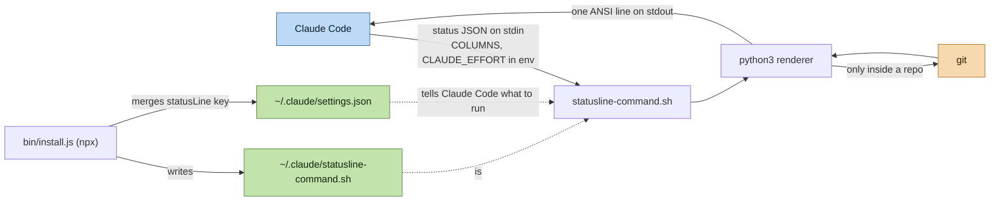

# System Architecture

`claude-code-statusline-progress` renders the Claude Code status line: one ANSI-colored
line showing the model, reasoning effort, working directory and git branch, a
context-window gauge, 5-hour and 7-day rate-limit gauges, and session cost/duration.

Full diagram catalog: [diagrams.md](diagrams.md).

## Architecture Style

A **single-process filter**, not a service. There is no server, database, cache, queue,
or network call anywhere in the codebase. The entire runtime is:

```
status JSON on stdin  →  bash prologue  →  python3 heredoc  →  one line on stdout
```

Two executables, run at completely different times:

| Path | Executable | Runtime | Frequency |
|---|---|---|---|
| Install | [`bin/install.js`](../../bin/install.js) | Node ≥18, ESM | once, via `npx` |
| Render | [`statusline-command.sh`](../../statusline-command.sh) | bash + `python3` | every status line refresh |

They share no code. Their only coupling is the pair of files the installer writes into
`~/.claude/`: the patched script itself, and the `statusLine` key in `settings.json`
that tells Claude Code to run it.

The rendering script is deliberately dependency-free — the Python is inlined as a quoted
heredoc rather than shipped as a module, so the installed artifact is a single
self-contained file that can be copied by hand.

## System Components

### Host — Claude Code
Owns the process lifecycle. On each refresh it spawns the command with `COLUMNS` and
`CLAUDE_EFFORT` in the environment and the status JSON piped to stdin, then captures
stdout. Refreshes happen on activity and on an idle timer — **not** on terminal resize —
so a new width is picked up on the next refresh, not instantly.

### Bash prologue — [`statusline-command.sh:1-22`](../../statusline-command.sh#L1-L22)
Does two things only: slurps stdin into `$input`, and resolves terminal width through a
four-step fallback chain (`$COLUMNS` → `stty size` → `tput cols` → `80`), validating at
each step that the value is a positive integer. Because stdout is captured rather than
attached to a tty, the `stty`/`tput` steps are effectively manual-testing fallbacks.

### Python renderer — [`statusline-command.sh:23-311`](../../statusline-command.sh#L23-L311)
Everything else. Four stages:

1. **Parse and normalize** — `json.loads` wrapped so any failure yields `{}`; every
   nested object re-checked with `isinstance(..., dict)`; every number passed through
   `_num()`, which rejects `bool`, `NaN` and `inf`.
2. **Derive** — token usage (`total_input_tokens`, else the sum of the three
   `current_usage` fields), `~`-collapsed cwd, and the optional git branch.
3. **Paint** — `color_for()` interpolates green → yellow → red across the configured
   thresholds; `context_bar()` and `usage_bar()` build cell strings.
4. **Assemble responsively** — greedy segment selection against the column budget, then
   grow the bar into leftover space.

See [Component Relationships](diagrams.md#4-component-relationships--render-pipeline)
for the function-level data flow.

### Git integration — [`statusline-command.sh:82-109`](../../statusline-command.sh#L82-L109)
The only external process the renderer touches. Gated on `workspace.repo` being present
in the input, so outside a repo it makes **zero** subprocess calls. Inside one it runs
`git branch --show-current` and, only if that yields a branch, `git status --porcelain`,
each with a 0.3 s timeout. Any timeout, missing binary, or OS error degrades silently to
no branch indicator.

### Installer — [`bin/install.js`](../../bin/install.js)
Interactive `readline` prompts for six thresholds (validated: numeric, 0–100, danger
strictly greater than warn), then a regex `patch()` that rewrites each
`CONSTANT = <float>` line in a copy of the script, a write to
`~/.claude/statusline-command.sh` at mode `0o755`, and a **merge** into
`~/.claude/settings.json` that preserves existing keys. An unparseable `settings.json`
aborts with exit 1 rather than overwriting the user's config.

### External Dependencies
None at runtime beyond what the host already has: `bash`, `python3` (standard library
only), and optionally `git`. No npm dependencies — `package.json` declares no
`dependencies` block at all.

## Architecture Diagrams

| View | Diagram |
|---|---|
| System overview | [§1](diagrams.md#1-system-architecture) |
| Render sequence | [§2](diagrams.md#2-data-flow--status-line-render) |
| Install sequence | [§3](diagrams.md#3-data-flow--install) |
| Component relationships | [§4](diagrams.md#4-component-relationships--render-pipeline) |
| Input JSON contract | [§5](diagrams.md#5-input-contract--status-json) |
| Color state machine | [§6](diagrams.md#6-state-machine--bar-cell-color) |
| Responsive degradation | [§7](diagrams.md#7-responsive-degradation-ladder) |
| Directory structure | [§8](diagrams.md#8-directory-structure) |

### System Overview



## Key Design Decisions

### 1. Inline Python inside a bash heredoc
**Context:** The renderer needs real string/number handling (JSON parsing, RGB
interpolation, ANSI-aware width math) but must install as a single file a user can
`cp` into `~/.claude/`.
**Decision:** Keep a thin bash wrapper for stdin capture and width detection, and put
all logic in a `<<'PY'` quoted heredoc passed to `python3`, with the JSON handed over as
`argv[1]` and config as environment variables.
**Consequences:** One self-contained artifact, no module resolution, no interpreter
shebang juggling — at the cost of no unit-testable module boundary. Testing is done by
piping JSON at the script (see the README's testing section).

### 2. Defensive parsing of every input field
**Context:** The status JSON is produced by the host and its shape varies across Claude
Code versions; a crash here means a broken status line, or worse, visible tracebacks.
**Decision:** Treat every field as optional. Wrap the parse, re-check every nested
object's type, funnel every number through `_num()`, and supply an explicit fallback
(`"Claude"`, `1_000_000`, `--` tokens, omitted section) for each.
**Consequences:** `echo '{}' | bash statusline-command.sh` renders a valid line. New or
renamed upstream fields degrade a segment instead of failing the render. The cost is
verbosity — roughly a third of the Python is guards.

### 3. Thresholds are env-overridable, not just baked in
**Context:** Before commit `7ca2245` the six thresholds were hardcoded constants, so the
only way to change them was editing the installed script — and since `installScript()`
rewrites that file from the packaged source, a re-install discards those edits.
**Decision:** Read each threshold through `_envf(name, default)`, so `CONTEXT_WARN=0.10`
in the environment wins without touching the file. The installer's regex patch still
sets the defaults at install time.
**Consequences:** Two configuration surfaces that must stay in agreement — the installer
writes fractions in exactly the format the regex expects. A misconfigured pair
(`danger <= warn`) would divide by zero in `_lerp`, so each pair is clamped with
`danger = max(danger, warn + 0.01)` immediately after parsing.

### 4. Greedy priority ladder for narrow terminals
**Context:** The line must never wrap, at any width, but on a wide terminal should use
the space.
**Decision:** Enable optional segments one at a time at the minimum bar width in fixed
priority order — token detail → 5h → 7d → cost — re-measuring after each, then expand
the bar into whatever columns remain (`MIN_BAR` 3 … `MAX_BAR` 20).
**Consequences:** Predictable, stable degradation. One explicit exception encodes the
priority honestly: cost is suppressed when a 7-day gauge that *has* data was dropped for
width, so a lower-priority segment can never appear above a hidden higher-priority one.

### 5. Git lookup gated on `workspace.repo`
**Context:** The status line re-renders frequently; spawning `git` twice per refresh in
every directory would be a per-keystroke cost.
**Decision:** Only attempt git when the host already reports a repo, and bound each call
at 0.3 s.
**Consequences:** No subprocess cost outside repos, bounded cost inside them. On a very
large or slow repo `git status --porcelain` may time out, and the branch indicator
silently disappears for that refresh rather than stalling the line.

## Performance Characteristics

Cost per refresh is one `python3` interpreter start plus, inside a repo, up to two
`git` invocations capped at 0.3 s each. There is no caching, no state carried between
refreshes, and no I/O other than stdin, stdout, and the git subprocesses. The renderer
holds only the parsed JSON in memory.

## Security Considerations

The script consumes JSON from the host on stdin and never evaluates it — parsing is
`json.loads`, and all subprocess calls use list-form `subprocess.run` with a fixed
argv, so no input value can reach a shell. The only path that writes outside the repo is
the installer, which touches exactly two files under `~/.claude/` and refuses to
overwrite a `settings.json` it cannot parse.

## Future Evolution

- No automated test suite exists; the pure `stdin → stdout` contract makes a
  golden-output harness over a fixture set of JSON payloads the natural next step.
- The two configuration surfaces (installer regex, env vars) could collapse into a
  single config file read by the renderer, removing the patch step entirely.
