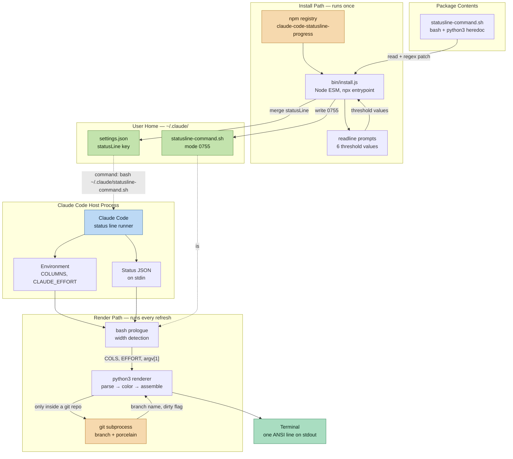
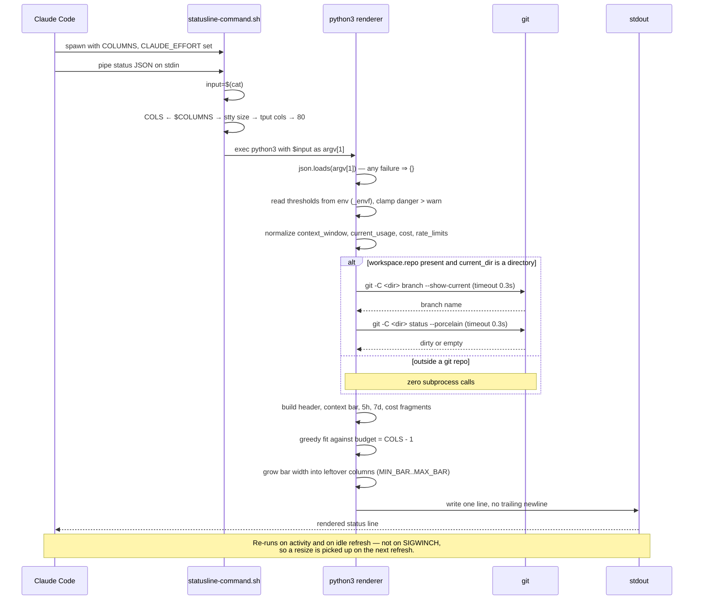
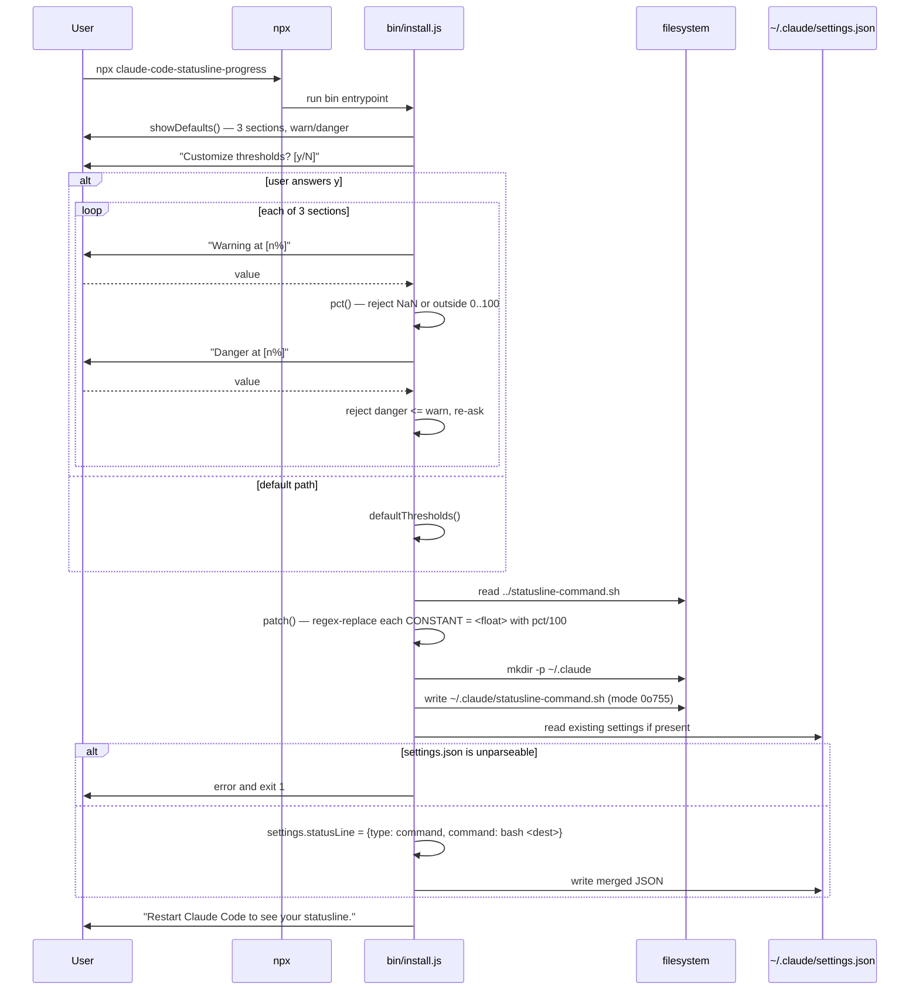
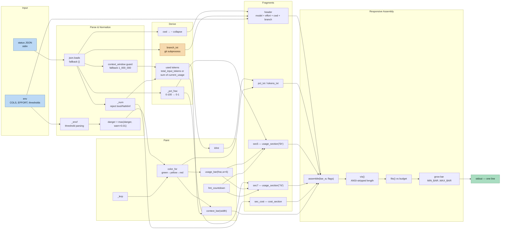
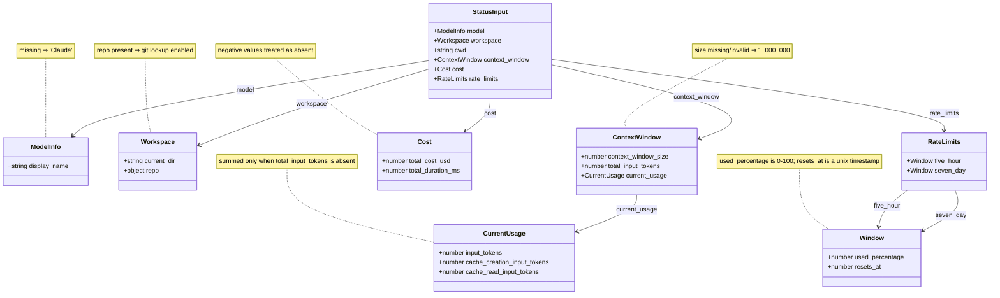
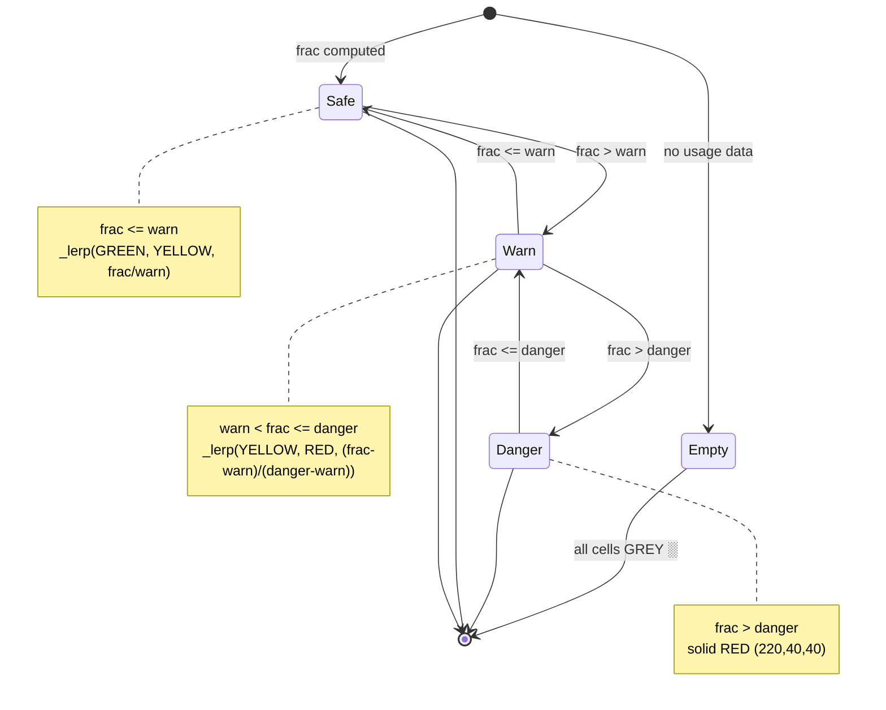
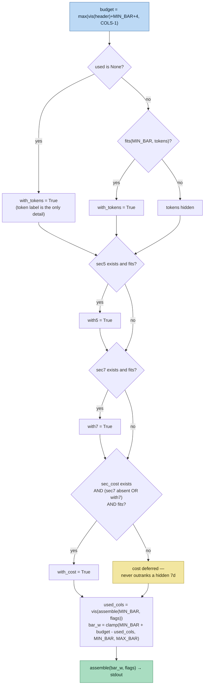
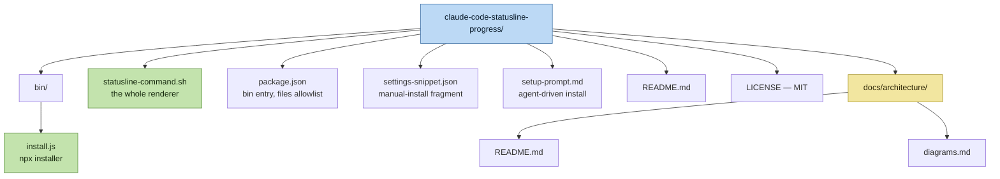

# Architecture Diagrams

All diagrams below are generated from the actual source in this repo:
[`statusline-command.sh`](../../statusline-command.sh) and
[`bin/install.js`](../../bin/install.js). Component names match identifiers in the code.

Preview any block by pasting it into <https://mermaid.live>, or view inline with a
Mermaid-capable Markdown renderer.

---

## 1. System Architecture

Two independent paths: a one-time **install** path (Node) and a per-refresh **render**
path (bash + embedded Python). They meet only at two files under `~/.claude/`.

---

## 2. Data Flow — Status Line Render

One refresh, end to end. The script is a pure `stdin → stdout` filter; the only side
effect is the optional `git` subprocess pair.

---

## 3. Data Flow — Install

---

## 4. Component Relationships — Render Pipeline

Functions and the data they exchange, as defined in the Python block.

---

## 5. Input Contract — Status JSON

The stdin object as the renderer consumes it. Every field is optional; each has an
explicit fallback. Types are what the code accepts after `_num` / `isinstance` guards.

---

## 6. State Machine — Bar Cell Color

`color_for(frac, warn, danger)` maps a fraction to an RGB escape. Cells are colored by
their own position `(j+1)/width`, not by the overall fill, so a bar gradients across
itself.

Threshold pairs, each `_envf`-overridable and clamped so `danger > warn`:

| Gauge | Warn | Danger |
|---|---|---|
| Context window | `CONTEXT_WARN` 0.20 | `CONTEXT_DANGER` 0.50 |
| 5-hour usage | `USAGE_5H_WARN` 0.50 | `USAGE_5H_DANGER` 0.90 |
| 7-day usage | `USAGE_7D_WARN` 0.50 | `USAGE_7D_DANGER` 0.90 |

---

## 7. Responsive Degradation Ladder

Segments are enabled greedily at `MIN_BAR` width in strict priority order, then the bar
absorbs whatever columns remain.

---

## 8. Directory Structure

